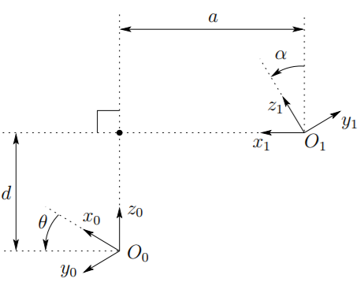

# TuDow3-Kinematics 土豆3號-順向/逆向 動力學
My Robot TuDow3 simulation w/ Forward/Inverse Kinematics    

Denavit-Heartenburg parameters definition
    

### References
  - [THE DENAVIT-HARTENBERG CONVENTION ](https://users.cs.duke.edu/~brd/Teaching/Bio/asmb/current/Papers/chap3-forward-kinematics.pdf)
