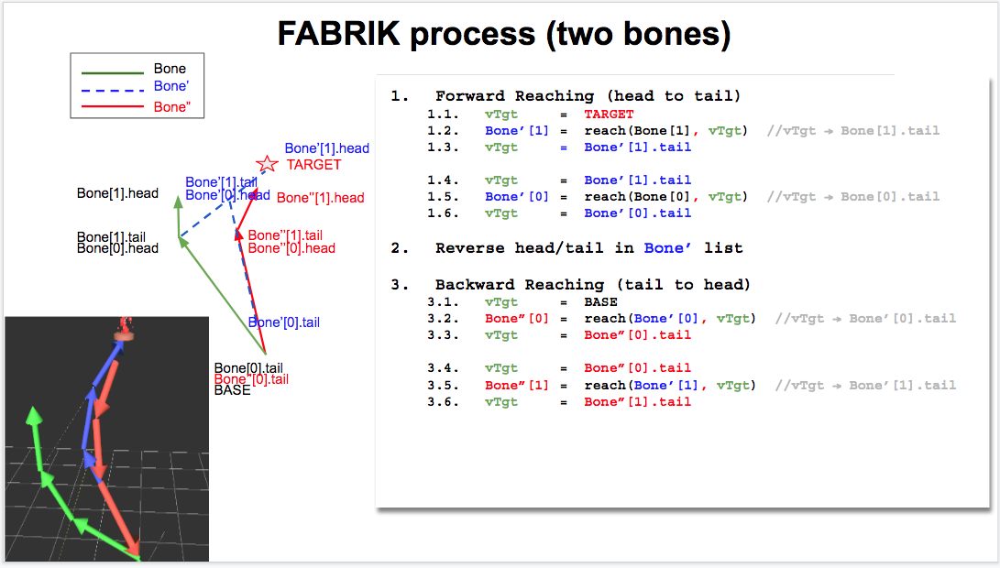

# TuDow3-Kinematics 土豆3號-順向/逆向 動力學
My Robot TuDow3 simulation w/ Forward/Inverse Kinematics and FABRIK    
There is another project TuDow2 2DOF w/ analytic at [TuDow2](https://github.com/jmysu/TuDow2_Kinematics)

  

My FABRIK process tuned for C++
   

TD3 IK Test1
  
TD3 IK Test2
   

### References
  - [libQGLViewer](http://libqglviewer.com/)
  - [FORWARD KINEMATICS:THE D-H CONVENTION](https://users.cs.duke.edu/~brd/Teaching/Bio/asmb/current/Papers/chap3-forward-kinematics.pdf)
  - [FABRIK algorithm in 2D](http://sean.cm/a/fabrik-algorithm-2d)
